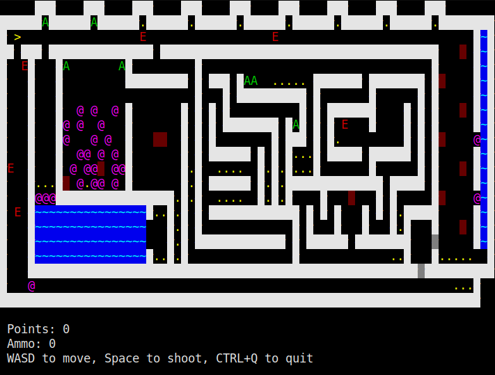

<h1 align="center">Pascal Terminal Game</h2>
<p align="center">Just a simple 2D terminal game made in Pascal</p>
<p align="center">
	<a href="./LICENSE">
		
	</a>
	<a href="https://github.com/LordsTrident/pas-term-game/issues">
		
	</a>
	<a href="https://github.com/LordsTrident/pas-term-game/pulls">
		
	</a>
	<br><br><br>
	
</p>

## Compiling and running
#### Linux
Run `compile` as bash in the terminal:
```sh
bash compile
```
If you dont want it to check for fpc, use the `-nc` parameter.
Then cd into `levels` and run the default levels by running `run` as bash:
```sh
cd levels
bash run
```

## Making a level
Levels are stored in files, the name doesnt matter.
To create a level, make a new file and put the map inside curly braces (make sure the curly braces are on the start of the line and not on the same line as the map start/end)
> Note: All the map lines have to be the same width, if some line is longer than the first one it will get cut off.

List of usable characters and what they mean:
- `#`: Solid wall
- `@`: Pushable box
- `P`: Player spawn (Default spawn position is X 1 Y 1)
- `.`: Point
- `A`: Ammunition
- `D`: Door (Opens after all points were collected)
- `H`: Horizontaly moving deadly wall
- `V`: Vertically moving deadly wall
- `E`: Randomly moving deadly enemy
- `B`: Invisible barrier (Player can pass)
- `N`: Invisible barrier (Player cant pass)
- `~`: Water (Boxes cant be pushed onto water)
- `G`: Grass (Decoration)
- Space: Floor (Nothing)

If you use a character not listed here, it will be turned into a floor.
To run your map, simply put the file name in the program command line parameters (you can put multiple file names and multiple maps will be ran after eachother)

## Controls
- `WASD` - Move
- Space - Shoot
- `CTRL`+`Q` - Quit
- `CTRL`+`N` - Quit the current map and go to the next one
